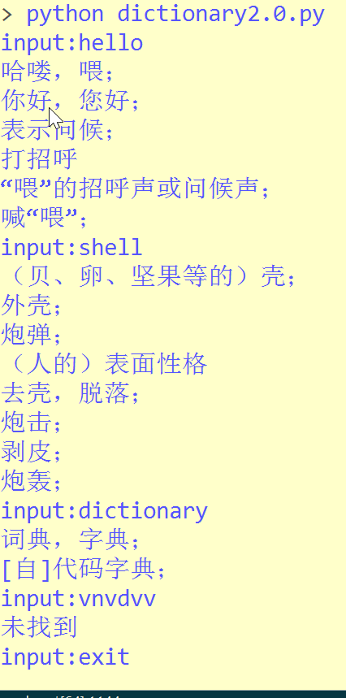

# Dictionary_In_Shell based on python crawler
##背景

    在windows下一些查词软件的性能并不一定理想，比如我们想要查询一个单词的简单含义
    却需要经过比较复杂的操作，而在linux系统下没有特别方便的单词软件，因此我通过
    python    编写了爬虫脚本，通过在shell中运行pythn脚本，快速得到所查询单词的含义
    
  ##原理
  
    类似爬虫，用户在shell输入单词，通过http请求模拟查单词过程，返回结果用正则表达式解析，提取出翻译
    
   ##运行截图
   
   
