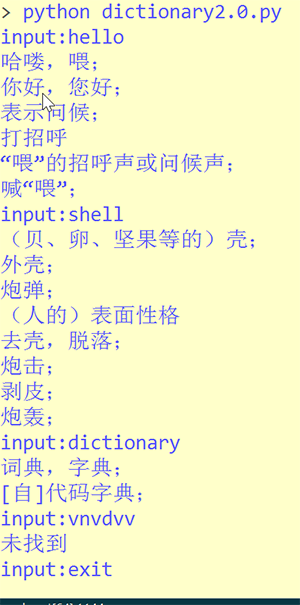

# Dictionary_In_Shell based on python crawler

## Summary

Some softwares in Windows are not easy to use. We may need complex operation to find the meaning of a word. In linux there is no software that's convenient so I write a crawler python script. We can easily get the meaning of a world by running the script in the shell. 

## How it works

First run the script

```bash
python3 dictionary2.0.py
```

User input the word in the shell, the script send http request and return the result. We use re to extract the result and print it.

## Docker support

For docker users, you can pull the image from dockerhub.

```bash
docker pull ruiheng/shell-dictionary:dic
```

Then

```bash
docker container run -it ruiheng/shell-dictionary:dic
```

Then you run into the shell environment and other commands are the same.
    
## Screenshot
   

